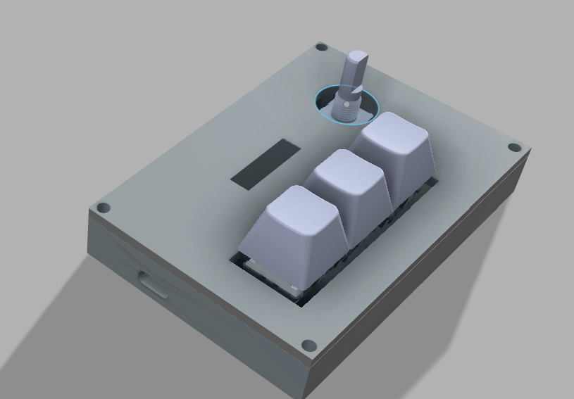
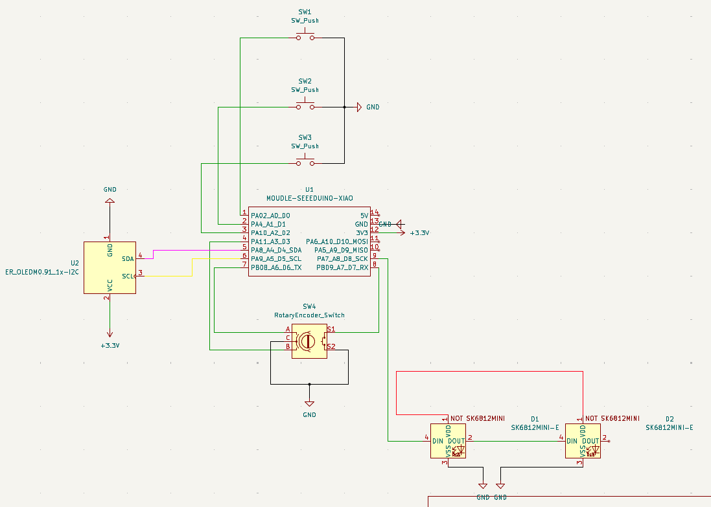
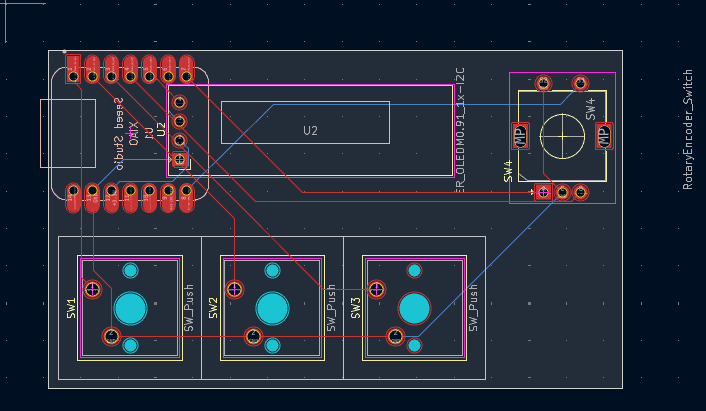
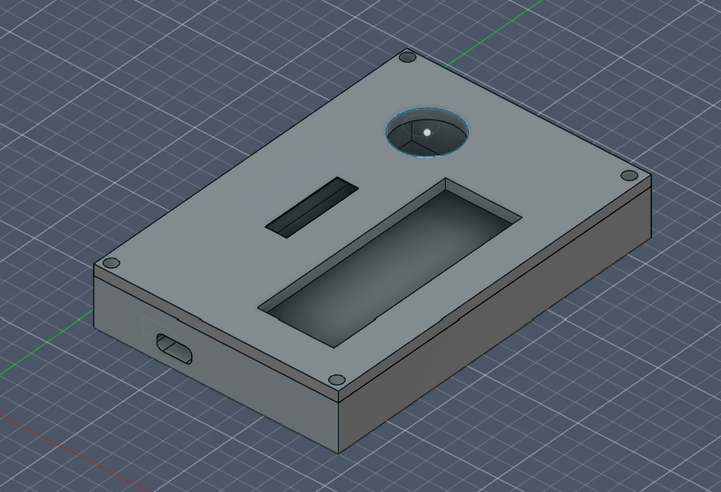

## My HackPad

**KeyLayout**
1st key -> Windows Bttn + D (window hider)
2nd key -> CTRL+ SHIFT + M (DIscord Mute)
3rd key -> Right Mouse Bttn Click, then Q (Devtools firefox)
Rotary encoder -> scroll down/up
Display -> Bongo Cat

Render of expected final product

Schematic of the circuit

Picture of PCB 

Picture of Case

# Bill of Materials (BOM)

| Component | Qty |
|-----------|-----|
| Seeed XIAO RP2040 Microcontroller | 1 |
| MX-Style Mechanical Switches | 3 |
| EC11 Rotary Encoder (20mm D-Shaft) | 1 |
| 0.91" 128×32 OLED Display | 1 |
| Blank DSA Keycaps | 3 |
| SK6812 MINI-E RGB LEDs | 3 |
| M3×16mm Screws | 4 |
| M3×5×4mm Heatset Inserts | 4 |
| PCB (JLCPCB fabrication) | 1 |
| 3D Printed Case (Gift card) | 1 |
| Soldering iron (Gift card) | 1 |

